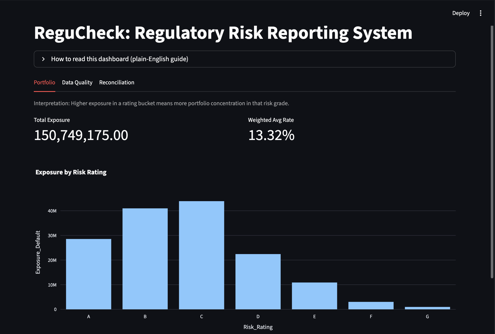
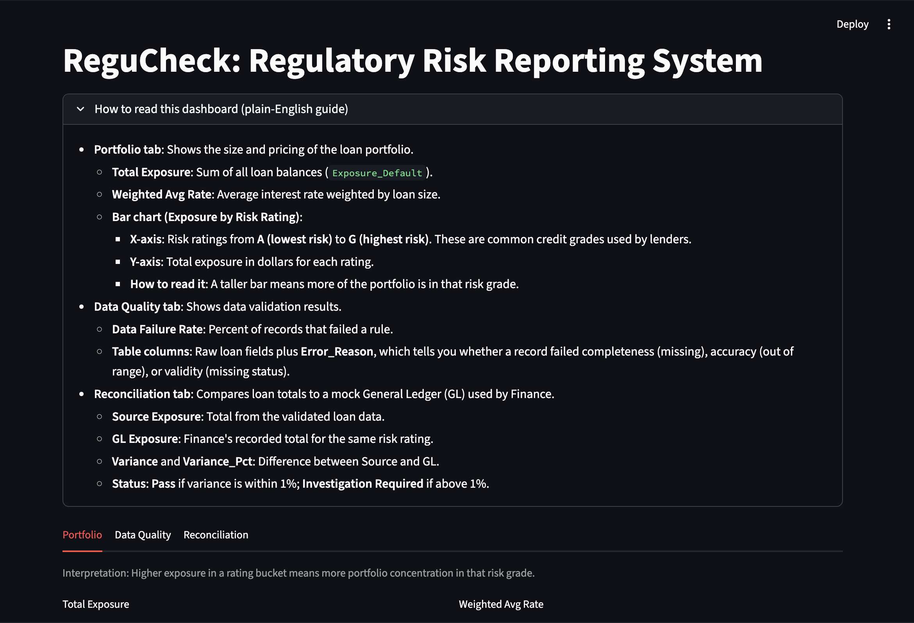
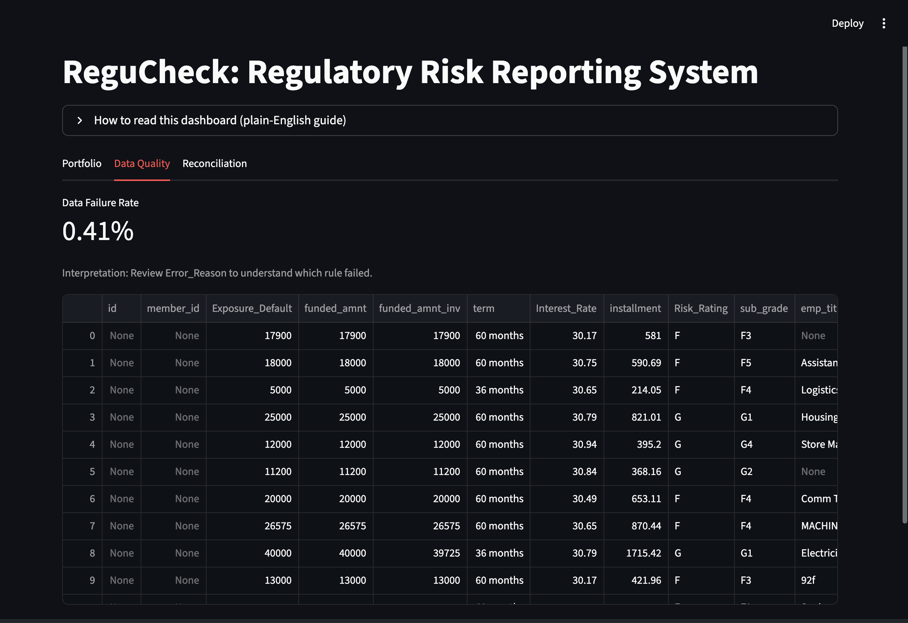
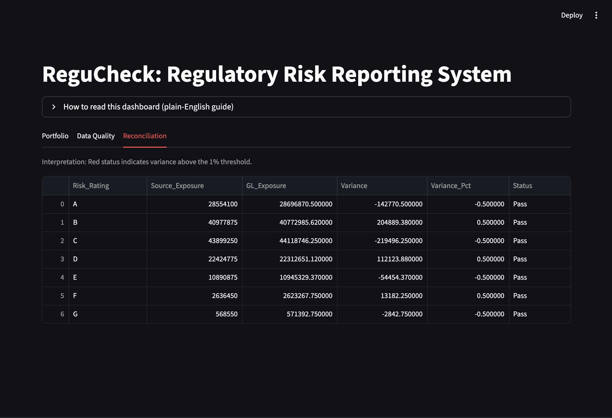

# ReguCheck — Regulatory Risk Reporting System

ReguCheck is a compact, end‑to‑end risk data pipeline that mirrors how banks
turn raw loan files into a reporting‑ready view: **ingest → validate → reconcile
→ report**. It uses public Lending Club data to demonstrate governance checks,
control reconciliations, and business‑friendly reporting in one flow.



## What this project does

- **Automated data ingestion** from Kaggle using `kagglehub`
- **Governance & validation** checks for completeness, accuracy, and validity
- **Reconciliation control** against a mock General Ledger (GL)
- **Interactive dashboard** built with Streamlit and Plotly

## Architecture (Pipeline)

1. **`data_loader.py`**  
   Downloads the dataset, locates the CSV, samples to 10,000 rows for speed,
   standardizes column names, and outputs `staged_loan_data.csv`.

2. **`governance_engine.py`**  
   Applies data quality rules and splits the data into:
   - `validated_loans.csv` (clean)
   - `dq_exceptions.csv` (errors with `Error_Reason`)

3. **`reconciliation.py`**  
   Compares validated exposure totals by risk rating vs. a mock GL, calculates
   variance and status, and outputs `recon_report.csv`.

4. **`app.py`**  
   Streamlit dashboard with three tabs:
   - **Portfolio**: KPIs + exposure by risk rating
   - **Data Quality**: exception records + failure rate
   - **Reconciliation**: variance report with conditional formatting

## Getting started

### 1) Install dependencies

```
pip install -r requirements.txt
```

### 2) Run the pipeline (in order)

```
python data_loader.py
python governance_engine.py
python reconciliation.py
```

### 3) Launch the dashboard

```
streamlit run app.py
```

## Dashboard guide (plain English)

- **Portfolio tab**  
  Shows total exposure and weighted average rate. The bar chart displays exposure
  by **Risk Rating (A–G)** where **A = lowest risk** and **G = highest risk**.

- **Data Quality tab**  
  Shows rows that failed validation and a **Data Failure Rate** (% of bad rows).

- **Reconciliation tab**  
  Compares data vs. mock GL totals. Variance > 1% is flagged as **Investigation
  Required**.

## Screenshots






## Hosting / Deployment

### Can we host on GitHub Pages?
**Not directly.** GitHub Pages only hosts static sites, while Streamlit apps
require a Python server.  

### Recommended options
- **Streamlit Community Cloud** (free for public GitHub repos)
- **Render**, **Railway**, **Fly.io**, or **Heroku**

### Streamlit Community Cloud (quickest)
1. Push this repo to GitHub.
2. Go to https://share.streamlit.io
3. Select your repo and set `app.py` as the entry point.

> Note: Kaggle downloads on first run may require you to set Kaggle credentials
> if the environment doesn’t already have them.

## Data notes

Raw CSVs are ignored by `.gitignore` to keep the repo lightweight. The pipeline
will regenerate them locally.

